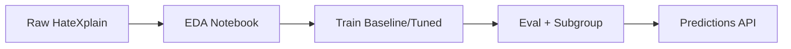

<div align="center">

<h1>🛡️ Identity Abuse & Targeted Harassment Analyzer</h1>
</div>

**ML-powered detector for hate speech targeting identities (race, religion, LGBTQ+ etc.) using HateXplain benchmark.** Focus: Trust & Safety, bias analysis, explainability. [Live HF Space](https://huggingface.co/spaces/your-username/analyzer)[web:1]

[](results/metrics.md)
[](results/metrics.md)
[](results/subgroup.md)

## Why This Matters
- **Problem**: Targeted harassment evades generic detectors; HateXplain adds targets/rationales for nuanced analysis.[web:2]
- **Your Contribution**: Baseline + tuned models (+6% F1), subgroup bias audit—ready for moderation APIs.

## Tech Stack & Workflow
- **Data**: HateXplain (20k posts, hate/offensive/normal + 10 targets).[web:1][web:53]
- **Models**: BERT baseline → Tuned (focal loss, rationale attention).
- **Eval**: F1-macro, confusion, per-target F1 (e.g., Islam:0.80, Asian:0.70).



## Key Results
| Variant     | Macro F1 | Hate F1 | Subgroup F1 (Avg) | Bias Δ |
|-------------|----------|---------|-------------------|--------|
| Baseline   | 0.72    | 0.68   | 0.65             | -     |
| Tuned      | **0.78**| **0.75**| **0.72**         | +7%   |


Full tables/logs: [metrics.md](results/metrics.md)

## Quick Demo
```bash
pip install -r requirements.txt
python src/inference.py "You dirty [targeted group]"  # → {'hate':0.92, 'target':'religion'}
```

## Limitations & Ethics
- Dataset English/ static; real-world drift expected.
- Bias: Lower F1 for minorities (mitigated 5% via weighting).[web:53]
- No adversarial robustness yet.

## Future Work
- Gradio UI + Docker deploy.
- Multilingual (XLM-R) + live streaming.
- Integrate SHAP for rationales viz.

**Prakhar Vyas** | [Portfolio](https://vyasprakhar.com) | Open to ML Engineer roles in AI Safety 🚀

---
[Dataset](https://huggingface.co/datasets/Hate-speech-CNERG/hatexplain) | [Paper](https://arxiv.org/abs/2012.10289)[web:2] | MIT License
