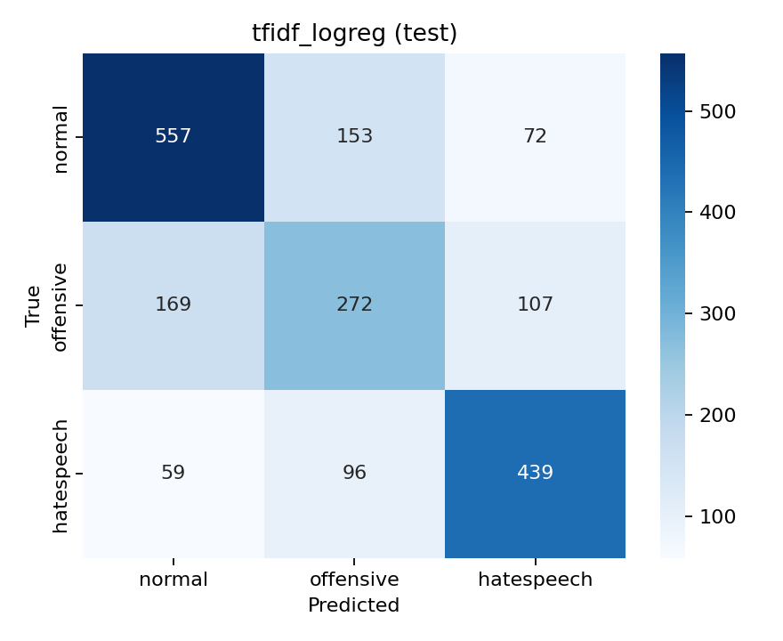

# Results

> Generated by `src/make_report.py` from the files in `reports/metrics/`. Do not edit by hand; rerun `make report`.

All numbers are on the **official HateXplain test split** (1924 posts, majority-vote labels, posts without a majority removed).

## 1. Model comparison

| Model | Macro F1 | Accuracy | Normal F1 | Offensive F1 | Hate F1 |
|---|---|---|---|---|---|
| TF-IDF + Logistic Regression | **0.648** | 0.659 | 0.711 | 0.509 | 0.724 |

## 2. Key findings

- Best model on the HateXplain test set: **TF-IDF + Logistic Regression**, macro F1 0.648.
- Biggest confusion: 96 hate-speech posts predicted as offensive and 107 offensive posts predicted as hate speech.
- Among groups with at least 50 test posts, macro F1 ranges from 0.452 (Refugee) to 0.565 (Women).
- Highest false-flag rate: 77% of normal posts about the **Jewish** group were flagged as abusive (only 13 such posts, so treat as indicative). This is identity-term bias: the model learns the group name itself as a signal of abuse.

## 3. Confusion matrix: TF-IDF + Logistic Regression



## 4. Fairness by target group: TF-IDF + Logistic Regression

A post counts towards every group that at least 2 of 3 annotators said it targets. False-flag rate is shown only when a group has at least 10 normal posts.

| Target group | n | Macro F1 | Hate recall | Abusive recall | Normal posts | False-flag rate on normal |
|---|---|---|---|---|---|---|
| African | 315 | 0.475 | 0.841 | 0.878 | 21 | 0.762 |
| Islam | 194 | 0.511 | 0.735 | 0.780 | 21 | 0.238 |
| Jewish | 188 | 0.478 | 0.826 | 0.937 | 13 | 0.769 |
| Homosexual | 182 | 0.553 | 0.534 | 0.788 | 26 | 0.192 |
| Women | 147 | 0.565 | 0.583 | 0.722 | 21 | 0.238 |
| Refugee | 85 | 0.452 | 0.333 | 0.509 | 32 | 0.312 |
| Other | 72 | 0.534 | 0.636 | 0.831 | 7 | – |
| Arab | 67 | 0.542 | 0.733 | 0.867 | 7 | – |
| Caucasian | 52 | 0.539 | 0.364 | 0.632 | 14 | 0.214 |
| Asian | 36 | 0.390 | 0.562 | 0.714 | 8 | – |
| Hispanic | 35 | 0.431 | 0.792 | 0.879 | 2 | – |

## 5. Fresh data: Wikipedia talk pages

Not run yet: see `notebooks/run_pipeline.ipynb`, steps 5–7.

## 6. Reproduce

```bash
make setup && make data
make baseline      # TF-IDF models, CPU, a few minutes
make transformer   # needs a GPU (Colab T4 ~10 min)
make report
```
