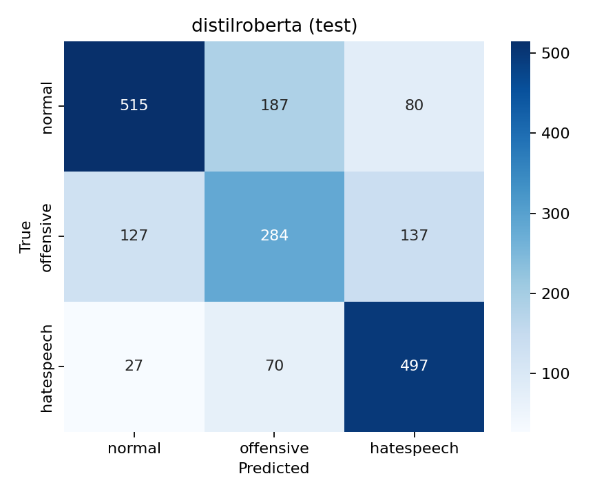

# Results

> Generated by `src/make_report.py` from the files in `reports/metrics/`. Do not edit by hand; rerun `make report`.

All numbers are on the **official HateXplain test split** (1924 posts, majority-vote labels, posts without a majority removed).

## 1. Model comparison

| Model | Macro F1 | Accuracy | Normal F1 | Offensive F1 | Hate F1 |
|---|---|---|---|---|---|
| TF-IDF + Logistic Regression | **0.648** | 0.659 | 0.711 | 0.509 | 0.724 |
| TF-IDF + MLP (untuned) | **0.633** | 0.660 | 0.722 | 0.457 | 0.720 |
| TF-IDF + MLP (dropout 0.3, class weights) | **0.641** | 0.653 | 0.708 | 0.501 | 0.713 |
| DistilRoBERTa (fine-tuned) | **0.664** | 0.674 | 0.710 | 0.522 | 0.760 |

## 2. Key findings

- Best model on the HateXplain test set: **DistilRoBERTa (fine-tuned)**, macro F1 0.664.
- That is +0.016 macro F1 over the logistic-regression baseline.
- Biggest confusion: 70 hate-speech posts predicted as offensive and 137 offensive posts predicted as hate speech.
- Among groups with at least 50 test posts, macro F1 ranges from 0.480 (African) to 0.635 (Refugee).
- Highest false-flag rate: 85% of normal posts about the **Jewish** group were flagged as abusive (only 13 such posts, so treat as indicative). This is identity-term bias: the model learns the group name itself as a signal of abuse.

## 3. Confusion matrix: DistilRoBERTa (fine-tuned)



## 4. Fairness by target group: DistilRoBERTa (fine-tuned)

A post counts towards every group that at least 2 of 3 annotators said it targets. False-flag rate is shown only when a group has at least 10 normal posts.

| Target group | n | Macro F1 | Hate recall | Abusive recall | Normal posts | False-flag rate on normal |
|---|---|---|---|---|---|---|
| African | 315 | 0.480 | 0.881 | 0.918 | 21 | 0.762 |
| Islam | 194 | 0.493 | 0.889 | 0.896 | 21 | 0.429 |
| Jewish | 188 | 0.495 | 0.891 | 0.966 | 13 | 0.846 |
| Homosexual | 182 | 0.581 | 0.726 | 0.865 | 26 | 0.346 |
| Women | 147 | 0.621 | 0.694 | 0.762 | 21 | 0.381 |
| Refugee | 85 | 0.635 | 0.611 | 0.755 | 32 | 0.375 |
| Other | 72 | 0.626 | 0.727 | 0.862 | 7 | – |
| Arab | 67 | 0.534 | 0.889 | 0.933 | 7 | – |
| Caucasian | 52 | 0.576 | 0.636 | 0.553 | 14 | 0.214 |
| Asian | 36 | 0.496 | 0.688 | 0.750 | 8 | – |
| Hispanic | 35 | 0.345 | 0.958 | 0.909 | 2 | – |

## 5. Fresh data: Wikipedia talk pages

Not run yet: see `notebooks/run_pipeline.ipynb`, steps 5–7.

## 6. Reproduce

```bash
make setup && make data
make baseline      # TF-IDF models, CPU, a few minutes
make transformer   # needs a GPU (Colab T4 ~10 min)
make report
```
